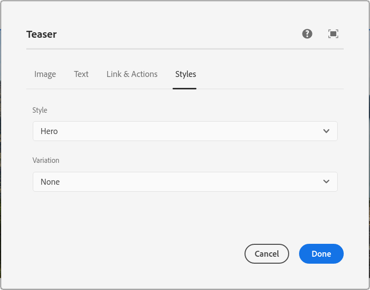

# Add style tab to all components configuration dialogs

This is a project template for AEM-based applications. It is intended as a best-practice set of examples as well as a potential starting point to develop your own functionality.

## Modules

There is only a single module: the OSGi bundle.

To deploy only the bundle to the author, run:

    mvn clean install -PautoInstallBundle

It makes little sense to have this on publish.

## How it works

The bundle adds a component-level filter that simulates an included
`style_tab`. E.g., for the core container we get at `http://localhost:4502/mnt/override/libs/core/wcm/components/container/v1/container/cq:dialog.5.json`

```json
{
  "trackingFeature": "core-components:container:v1",
  "extraClientlibs": [
    "core.wcm.components.container.v1.editor"
  ],
  "sling:resourceType": "cq/gui/components/authoring/dialog",
  "jcr:primaryType": "nt:unstructured",
  "jcr:title": "Container",
  "helpPath": "https://www.adobe.com/go/aem_cmp_container_v1",
  "content": {
    "sling:resourceType": "granite/ui/components/coral/foundation/container",
    "jcr:primaryType": "nt:unstructured",
    "granite:class": "cmp-container__editor",
    "items": {
      "jcr:primaryType": "nt:unstructured",
      "tabs": {
        "sling:resourceType": "granite/ui/components/coral/foundation/tabs",
        "jcr:primaryType": "nt:unstructured",
        "maximized": true,
        "items": {
          "jcr:primaryType": "nt:unstructured",
          "properties": {
            "sling:resourceType": "granite/ui/components/coral/foundation/container",
            "jcr:primaryType": "nt:unstructured",
            "jcr:title": "Properties",
            "margin": true
          },
          "styletab": {
            "path": "cq/gui/components/authoring/dialog/style/tab_edit/styletab"
          }
        }
      }
    }
  }
}
```

For now no check are made: the tab is always added as the last child of the 4-th level child (this works for core components)
and it might be empty (no styles to choose from).

## Screenshot:

